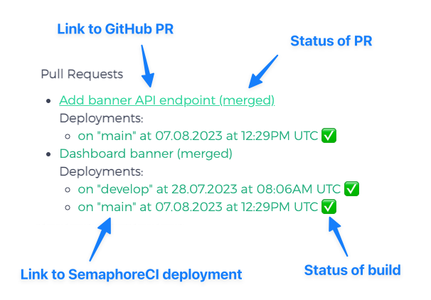

# Gnosis
[](https://renuo.semaphoreci.com/projects/gnosis)

Gnosis connects GitHub pull requests and deployments to your Redmine issues via a custom webhook.



## Conventions

The plugin can do its magic if you follow one of these conventions:
* The git branch name contains the Redmine ticket number in the form `/\/\d+/`, e.g. `feature/1337-update-rails`
* The pull request description contains the Redmine ticket number in the form `/TICKET-\d+/`

Have a look at the [`NumberExtractor`](https://github.com/renuo/gnosis/blob/main/app/models/number_extractor.rb#L3) for details.

## GitHub pull request tracking

The plugin provides a webhook endpoint for GitHub to call on PR updates.
Follow these steps to configure it:
1. Visit `https://github.com/ORG/REPO/settings/hooks`
2. Click on "Add Webhook"
3. Enter "Payload URL" to be Redmine URL + `/gnosis/github_webhook`
4. The secret is up for you to decide. It's important that this string is complex and secure.
5. Click "Let me select individual events." and choose "Pull Requests".
6. Configure the env variable `GITHUB_WEBHOOK_SECRET` with the secret you chose.

You should now be good to go!

## SemaphoreCI deployment tracking

**Important:** This is optional. You can simply use pull request tracking and skip this step.

### Configure SemaphoreCI

The plugin also provides a webhook to be called by SemaphoreCI.
Configure it like this:
1. Visit `https://ORG.semaphoreci.com/notifications`
2. Click on "New Notification"
3. Attributes like "Name of the notification" can be chosen freely. What you need to setup is: Listing your project under
"in projects", having `/.*-deploy\.yml/` under Pipelines (this just tells the notification to send data every time a
deploy script is done running), adding your Redmine URL + /gnosis/semaphore_webhook to "Endpoint" and typing `WEBHOOK_SECRET`
into the "Secret name" field.
Then go to your_org.semaphoreci.com/notifications and click on "New Secret". The "Name of the Secret" should be
`WEBHOOK_SECRET`. Then you create an environment variable with the "Variable Name" `WEBHOOK_SECRET`. The "Value" is the
secret. This should match the `SEMAPHORE_WEBHOOK_SECRET` in your `config/application.yml`.  
This should now also work just fine!

### Configure GitHub access token

The plugin needs to query the GitHub API every now and then to match-up pull requests with deployments.
For that you need to set the `GITHUB_ACCESS_TOKEN` env variable. For example you can configure it like this:
1. Visit <https://github.com/settings/tokens>
2. Click on "Generate new token"
3. Click the "(classic)" option
4. Check only the "repo" box.

If you make a deployment, all should correctly work now.

## Releasing from Redmine

The deployments page has a "New release" button that does what `renuo release` does on the command line,
but through the GitHub API — no SSH key or checkout on the Redmine server.

### Setup

1. Give the project a **Github Repository** project custom field. Both `renuo/my-project` and
   `https://github.com/renuo/my-project` are accepted; a bare `my-project` is read as `renuo/my-project`.
2. Grant the "Create releases" permission to the roles that are allowed to deploy.
3. The existing `GITHUB_ACCESS_TOKEN` needs write access to the repository.

### What the button does

The confirmation page shows everything `develop` adds on top of the default branch — the commit list, the
number of changed files and a link to the compare view on GitHub (which cannot be embedded, as GitHub sends
`X-Frame-Options: DENY`). You pick patch, minor, major or a custom version, tick the `*.rb` files whose
version string should be bumped, and confirm. Gnosis then:

1. commits the version bump to `develop` (one "Bump version" commit, skipped when nothing is ticked),
2. merges `develop` into the default branch,
3. creates the annotated tag on the merge commit.

Candidate version files come from GitHub code search plus the conventional `version.rb` paths, and every
candidate is read back so only files that really contain the current version are offered. At most 20 are
listed. Deploying late on a Friday asks for one extra confirmation, just like the CLI.

## Development

Choose one of the following ways to install Gnosis.

### Standalone checkout

Clone the repository anywhere, then let `bin/setup` create a Redmine installation
under `tmp/redmine` and symlink the plugin into it:

```bash
git clone git@github.com:renuo/gnosis.git
cd gnosis
bin/setup
bin/check
bin/run
```

To bootstrap a specific Redmine version, run `bin/setup <branch>` (or set `REDMINE_VERSION`).
Switching versions later requires removing `tmp/redmine` first.

Visit http://redmine.localhost:3000 and login with `developer:gnosisdev` or `admin:admin`.

### Existing Redmine installation

Alternatively, clone Gnosis directly into an existing Redmine installation's
`plugins/` directory:

```bash
cd <redmine>/plugins
git clone git@github.com:renuo/gnosis.git
cd gnosis
bin/setup
bin/check
```

### Scripts

* `bin/setup` installs dependencies and migrates the development and test databases.
* `bin/check` runs the plugin tests, `bin/fastcheck` the linters.
* `bin/run` starts the Redmine server with the plugin loaded.

### Further Work

You may want to add your own webhooks (e.g. if you have a different CI).
Have a look at [`webhooks_controller_test.rb`](test/functional/webhooks_controller_test.rb) for starters.

## Copyright

This work has been derived out of Anes Hodza's IPA at Renuo AG and is licensed under the MIT license.
You can find the full IPA documentation here: <https://github.com/aneshodza/ipa-documentation>.
